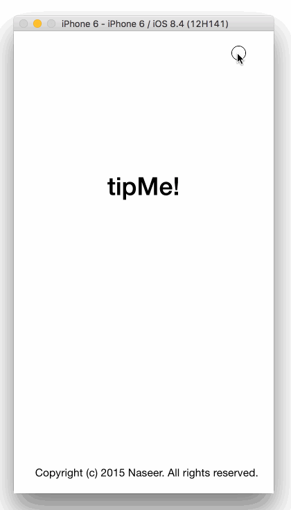

# TipCalculator

This is a Tip Calculator application for iOS submitted as the [pre-assignment](https://gist.github.com/timothy1ee/7747214) requirement for CodePath.

Time spent: 10 hours. (Most of the time was spent on Swift syntax).

Completed:

* [x] Required: User can enter a bill amount, choose a tip percentage, and see the tip and total values (Main view, supported on Portrait and Landscape modes).
* [x] Required: Settings page to change the default tip percentage (SettingsViewController loaded from Settings button click as navigation)
* [x] Optional: UI animations  (Using alpha for two views)
* [x] Optional: Remembering the bill amount across app restarts (if <10mins) (Using NSUserDefaults)
* [x] Optional: Using locale-specific currency and currency thousands separators (Using NSLocale)
* [x] Optional: Making sure the keyboard is always visible and the bill amount is always the first responder. This way the user doesn't have to tap anywhere to use this app. Just launch the app and start typing.

* [x] Also added a Split per person feature. 

Walkthrough GIF:

Softwares used:

1. GIF created with [LiceCap](http://www.cockos.com/licecap/).
2. IDE: XCode 7.0.1 on OSX 10.11 (El Capitan) and iOS Simulator
3. Github Desktop for Mac.
4. Smiley Images created using Preview.app & Keynote.app
